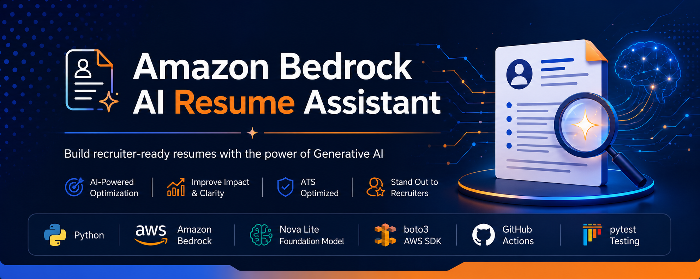

<p align="center">
  
</p>

<p align="center">
  
</p>

<h1 align="center">
Amazon Bedrock AI Resume Assistant
</h1>

<p align="center">
An AI-powered resume optimization application built with <strong>Amazon Bedrock (Nova Lite)</strong>, <strong>Python</strong>, and <strong>Boto3</strong> to generate recruiter-ready resumes optimized for Applicant Tracking Systems (ATS).
</p>

<p align="center">


</p>

---

# Live Demo

> 🚀 **Coming Soon**
>
> The application will be deployed on **Streamlit Community Cloud**, allowing users to optimize resumes directly from their browser.

---

# Overview

Recruiters typically spend less than **10 seconds** reviewing a resume before deciding whether to continue reading.

The **Amazon Bedrock AI Resume Assistant** leverages Amazon Bedrock's **Nova Lite** foundation model to intelligently rewrite resume content, improve professional summaries, strengthen achievement statements, and optimize resumes for Applicant Tracking Systems (ATS).

This project demonstrates practical implementation of modern cloud-native AI application development using:

- Amazon Bedrock
- Foundation Models
- Prompt Engineering
- Boto3 SDK
- Modular Python Architecture
- Automated Testing
- Continuous Integration with GitHub Actions

The application was built following software engineering best practices with clean architecture, modular design, automated testing, and CI/CD.

---

# Features

- AI-powered resume optimization
- Resume bullet point enhancement
- Professional summary generation
- ATS-friendly resume rewriting
- Prompt engineering with Amazon Bedrock
- Modular Python architecture
- Unit testing using pytest
- Continuous Integration with GitHub Actions
- Mock service for local development
- Easily extensible architecture

---

# Repository Preview

| Home | Resume Generation |
|------|-------------------|
|  |  |

*(Screenshots will be updated after deployment.)*

---

# Architecture

<p align="center">

```text
                    +--------------------+
                    |      User          |
                    +--------------------+
                               |
                               |
                               ▼
                    +--------------------+
                    |      app.py        |
                    +--------------------+
                               |
                               |
                               ▼
                    +--------------------+
                    | Prompt Templates   |
                    +--------------------+
                               |
                               |
                               ▼
                    +--------------------+
                    | Bedrock Client     |
                    +--------------------+
                               |
                               |
                               ▼
               +--------------------------------+
               | Amazon Bedrock (Nova Lite)     |
               +--------------------------------+
                               |
                               |
                               ▼
                    +--------------------+
                    | AI Response        |
                    +--------------------+
                               |
                               |
                               ▼
                    +--------------------+
                    | Optimized Resume   |
                    +--------------------+
```

</p>

> 📌 **Professional architecture diagram (Draw.io) will replace this diagram in the next release.**

---

# Technology Stack

| Category | Technology |
|-----------|------------|
| Programming Language | Python 3.12 |
| Cloud Platform | AWS |
| AI Service | Amazon Bedrock |
| Foundation Model | Amazon Nova Lite |
| AWS SDK | Boto3 |
| Testing | pytest |
| CI/CD | GitHub Actions |
| Version Control | Git |
| Repository | GitHub |

---

# Project Structure

```text
amazon-bedrock-resume-assistant/

│

├── .github/
│   └── workflows/
│       └── tests.yml
│
├── docs/
│   ├── images/
│   │   ├── banner.png
│   │   ├── architecture.png
│   │   ├── home.png
│   │   └── output.png
│
├── tests/
│   ├── test_app.py
│   ├── test_bedrock_client.py
│   ├── test_prompts.py
│   └── ...
│
├── app.py
├── bedrock_client.py
├── config.py
├── prompts.py
├── mock_service.py
│
├── requirements.txt
├── requirements-dev.txt
├── pytest.ini
│
├── README.md
└── LICENSE
```

---

# Getting Started

## Prerequisites

Before running the project, ensure you have:

- Python 3.12+
- Git
- AWS Account
- Amazon Bedrock enabled
- AWS CLI configured
- IAM permissions to invoke Bedrock models

---

# Installation

Clone the repository.

```bash
git clone https://github.com/ayomikunadaramola/amazon-bedrock-resume-assistant.git
```

Navigate into the project.

```bash
cd amazon-bedrock-resume-assistant
```

Create a virtual environment.

```bash
python -m venv .venv
```

Activate the environment.

### Windows

```bash
.venv\Scripts\activate
```

### macOS/Linux

```bash
source .venv/bin/activate
```

Install dependencies.

```bash
pip install -r requirements.txt
```

Install development dependencies.

```bash
pip install -r requirements-dev.txt
```

---

# Configuration

Configure your AWS credentials.

```bash
aws configure
```

Required IAM permissions include:

- bedrock:InvokeModel
- bedrock:InvokeModelWithResponseStream

Ensure your selected AWS Region supports Amazon Nova Lite.

---

# Running the Application

```bash
python app.py
```

---

# Running Tests

Run all tests.

```bash
pytest
```

Run with coverage.

```bash
pytest --cov=. --cov-report=term-missing
```

Expected output:

```text
========================

5 passed

Coverage: 100%

========================
```

---

# Example Workflow

```text
User uploads resume

        │

        ▼

Resume is parsed

        │

        ▼

Prompt generated

        │

        ▼

Amazon Bedrock

        │

        ▼

Nova Lite rewrites resume

        │

        ▼

Optimized resume returned
```

---

# CI/CD

GitHub Actions automatically executes on every:

- Push
- Pull Request

The workflow performs:

- Repository checkout
- Python installation
- Dependency installation
- Unit testing
- Status reporting

Workflow:

```
.github/workflows/tests.yml
```

Current Status

✅ Passing

---

# Roadmap

## Version 1.1

- Resume scoring
- Cover letter generation
- Job description matching

---

## Version 1.2

- PDF export
- DOCX export
- Resume templates

---

## Version 2.0

- Streamlit Web Application
- Authentication
- Resume history
- User accounts
- Analytics Dashboard

---

# Screenshots

## Application

> Coming Soon

---

## Resume Generation

> Coming Soon

---

## GitHub Actions

> Coming Soon

---

## Architecture Diagram

> Coming Soon

---

# Deployment

The application will be deployed on:

- Streamlit Community Cloud

Future deployment options:

- AWS Elastic Beanstalk
- AWS App Runner
- Docker
- ECS Fargate

---

# Contributing

Contributions are welcome.

1. Fork the repository

2. Create a feature branch

```bash
git checkout -b feature/new-feature
```

3. Commit changes

```bash
git commit -m "Add new feature"
```

4. Push changes

```bash
git push origin feature/new-feature
```

5. Open a Pull Request

---

# Author

## Ayomikun Adaramola

Senior Data Engineer

**Portfolio**

https://ayomikun-adaramola.netlify.app

**GitHub**

https://github.com/ayomikunadaramola

**LinkedIn**

https://www.linkedin.com/in/ayomikun-adaramola

---

# License

This project is licensed under the MIT License.

See the LICENSE file for details.

---

# Acknowledgements

This project was built using:

- Amazon Bedrock
- Amazon Nova Lite
- AWS SDK for Python (Boto3)
- GitHub Actions
- pytest
- Python Software Foundation

Special thanks to the AWS team for providing the Bedrock platform that powers this application.